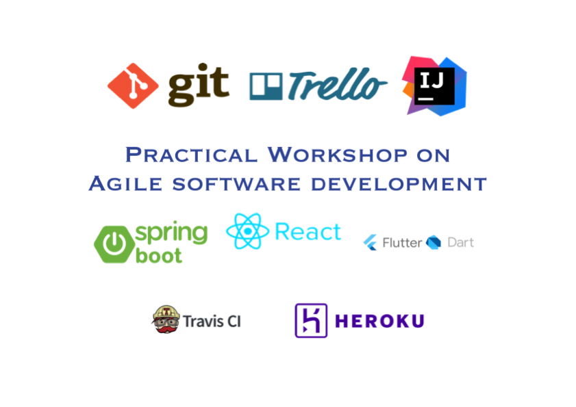
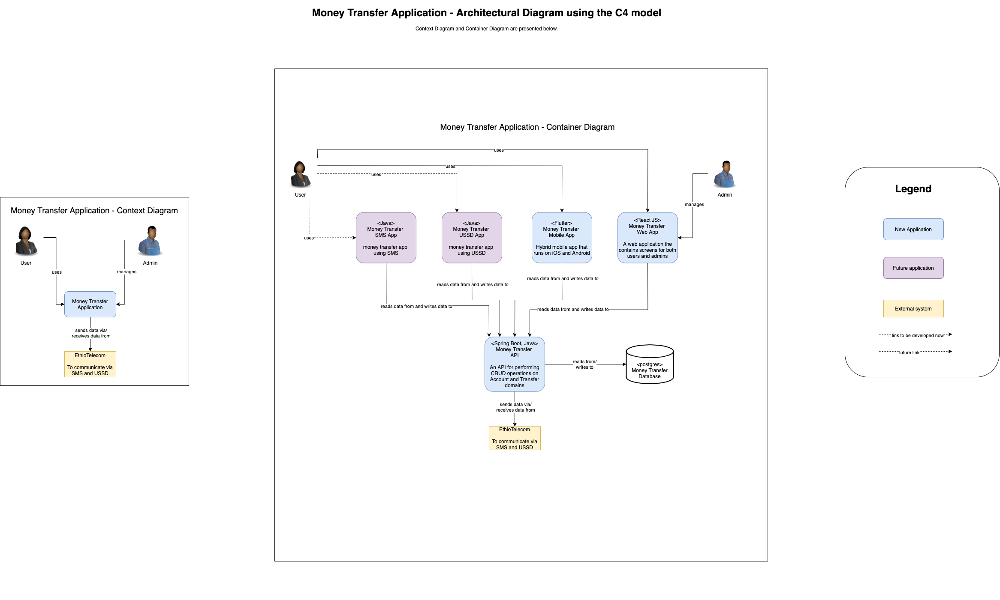

# Practical Workshop on Agile Software Development

The workshop will focus on practical experience sharing about agile software development methodology and detail day-to-day implementation of one of the agile methodologies i.e. SCRUM as well as step by step workshop on agile software development using a real-world implementation of a system.

## Objective of the workshop 
At the end of the course, trainees will have understanding, experience and knowledge of how American and European IT companies develop applications and be able to develop one using the same methodology and technology stack.

## Executive Summary of the workshop

The course will focus on practical experience sharing about agile software development methodology and detail day-to-day implementation of one of the agile methodologies: SCRUM. Then, introduction to Git version control system will follow with the purpose of acquainting trainees to the main features provided. Once students have a base on Git, we will develop an API using Spring Boot framework and Postgres database will be the next topic. Afterwards, we will develop a web application using ReactJS and Javascript, and a Hybrid (Android and iOS) mobile application using Flutter SDK and Dart programming language.

The course will be given in a practical way by developing a web and a mobile-based application using the recommended design patterns for developing APIs. The application we will develop is a simple money transfer system with features, which are common on most applications such as registering, logging in, sending money and listing the current balance and all transactions. Finally, this applications will be deployed to a cloud server called Heroku. 

Trainees will be divided into agile teams and will work on the project with high level of support from the instructor. Training on how to use Git distributed version control system and GitHub.com, Trello project management, Travis CI (continious intergration) as well as Heroku deployment platform will also be given.

At the end of the course, trainees will have experience and knowledge of how a system is developed in agile based software companies you know in Silicon Valley, Europe and all over the world.

## Architectural Diagram of the Money Transfer App built in this workshop  

## Required Resources
Every trainee should have a computer (preferably a high performance laptop) with high speed internet connection to install the required application packages. These are: 
- Installing SDKMAN! https://sdkman.io/install
  - Spring Boot with `sdk install springboot 2.4.3`
  - Java version 11 with `sdk install java 11.0.3.hs-adpt`
- IntelliJ IDEA Ultimate https://www.jetbrains.com/idea/download/#section=windows
- Downloads Node.js Latest LTS Version: 14.16.0 (includes npm 6.14.11) https://nodejs.org/en/download/
- Flutter SDK https://flutter.dev/docs/get-started/install/windows
- Download and install Android Studio https://developer.android.com/studio
- Set up the Android emulator https://flutter.dev/docs/get-started/install/windows#set-up-the-android-emulator
- Download Postman - a REST API Client (tester) https://www.postman.com/downloads/

## Websites to create accounts on
- github.com
- trello.com
- heroku.com

## Core Concepts Covered
- Agile Manifesto
- Scrum Roles and Cermonies
- Kanban Visualization
- Braking down big features into smaller and achievable tasks
- Microservices architecture
- C4 Architectual Diagraming
- TDD - Test Driven Development
- Pair Programming
- CI/CD - Continious Integration and Continious Deployment
- Using Source Code Management (SCM) or Version Control System (VCS)
- API (Application Programming Interface) development with a real database
- Web app development framework and integrating with an API
- Hybrid Mobile app development and integrating with an API

## Workshop content and schedule
### 1st day [Morning] [1 to 1.5 hours]
- Agile Software Development Methodology
  - Agile Manifesto
  - SCRUM: Process, Roles and Cermonies
  - KANBAN: Process

##### PRACTICE:
Organizing agile teams with in the trainees

### 1st day [Morning] [1 to 1.5 hours]
- Git version control system and Github.com
  - `git status`, `git add .`, `git commit -m "<message>"`, `git push`, `git pull`, `git clone`, `git branch`, `git merge`, `git rebase`, `git reset` 
- Trello project management
  
##### PRACTICE:
- Explanation of the system we will design (Money transfer app)
- Design the architecture using C4 model
- Create Github repository
- Create Trello board

### 1st day [Afternoon]
- Spring Boot with Java
  - Create Spring boot project using Intellij IDEA IDE
  - Create domain classes, controllers, services and repositories
  - Setup postgres database
  - TDD - Test Driven Development
  - Pair Programming

##### PRACTICE: 
- Installing SDKMAN, Git and Spring Boot
- Creating a free github account
- Use Spring boot and Java to develop the API and push it to github (using Git)
- Practicing TDD
- Practice Pair Programming with one of the attendees

### 2nd day [Morning]
- React JS

PRACTICE
- Create a reactjs project using [create-react-app] (https://github.com/facebook/create-react-app)
- Pushing it to Github (via Git)
- Create two web components: view transaction and balance, and send money
- Connect to the API - reading data (GET) and sending data (POST)

### 2nd day [Afternoon]
- Flutter SDK

##### PRACTICE
- Create a Flutter project
- Pushing it to Github (via Git)
- Create three screens with navigation: login, view transaction and balance, and send money
- Connect to the API - reading data (GET) and sending data (POST)

### Finally
- making our app production ready and our codebase look professional

##### PRACTICE
- Code refactoring
- Use Travis CI for running tests and deployment
- Deploying to Heroku
- Release the React app
- Release the mobile app to Google Play Store
- Show your app to the world!
- Handling production bugs

## References
- “Agile Software Development, Principles, Patterns, and Practices” By Robert C. Martin
http://www.amazon.com/gp/product/0135974445?ie=UTF8&tag=lstasd01-20&linkCode=as2&camp=1789&creative=9325&creativeASIN=0135974445 
- “Agile Estimating and Planning” by Mike Cohn 
http://www.amazon.com/gp/product/0131479415?ie=UTF8&tag=lstasd01-20&linkCode=as2&camp=1789&creative=9325&creativeASIN=0131479415
- Scrum and XP from the trenches
https://www.crisp.se/bocker-och-produkter/scrum-and-xp-from-the-trenches 
- Kanban Scrum Minibook
http://www.infoq.com/minibooks/kanban-scrum-minibook

## Further Links
- Top 20 Agile Development Books Ever
http://noop.nl/2008/06/top-20-best-agile-development-books-ever.html

